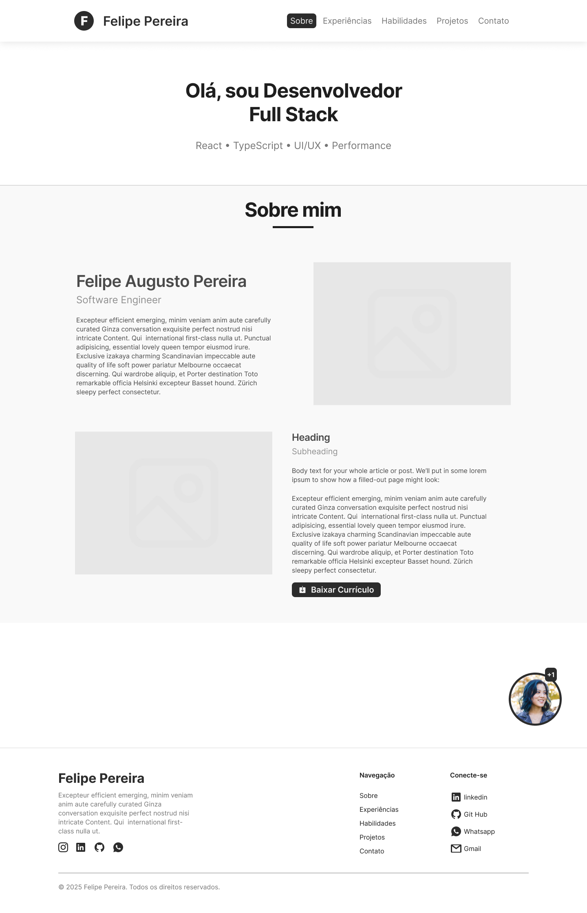
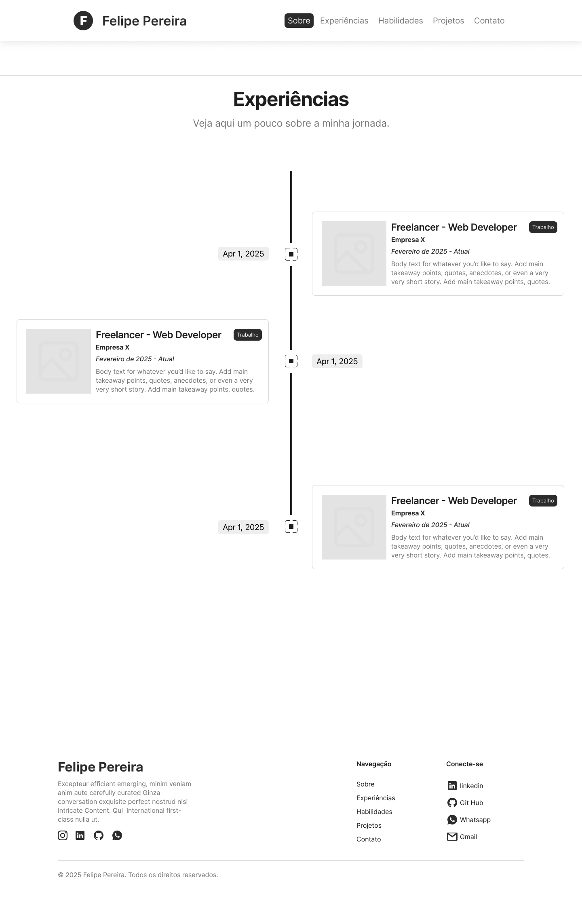
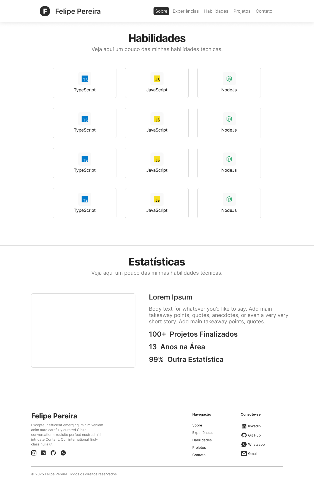
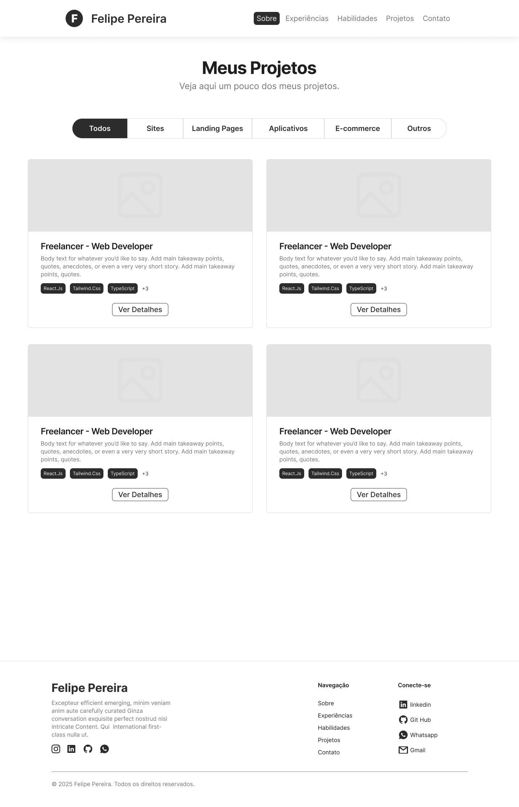
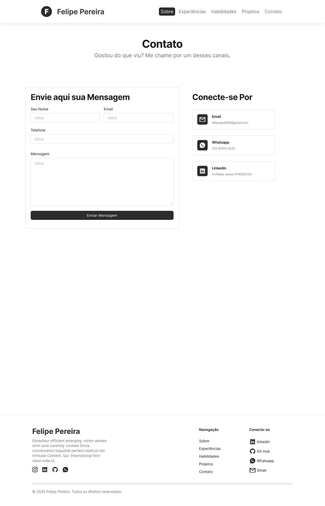
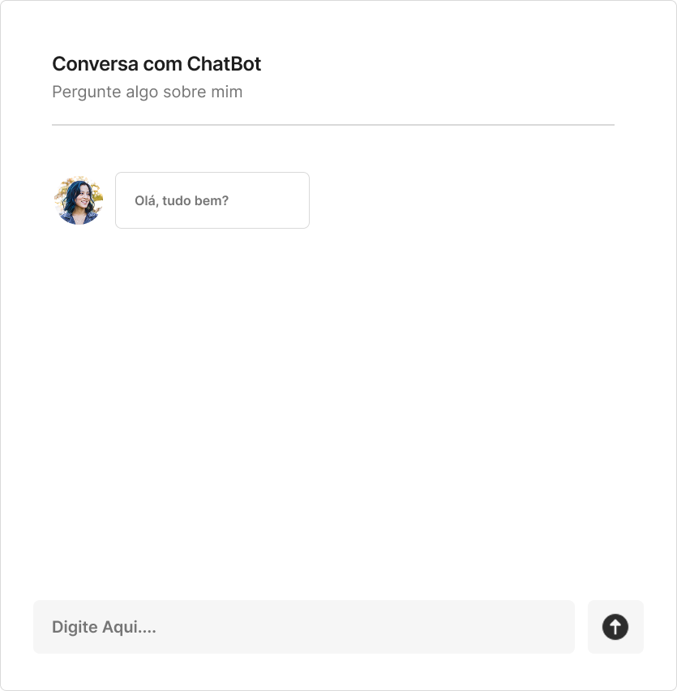
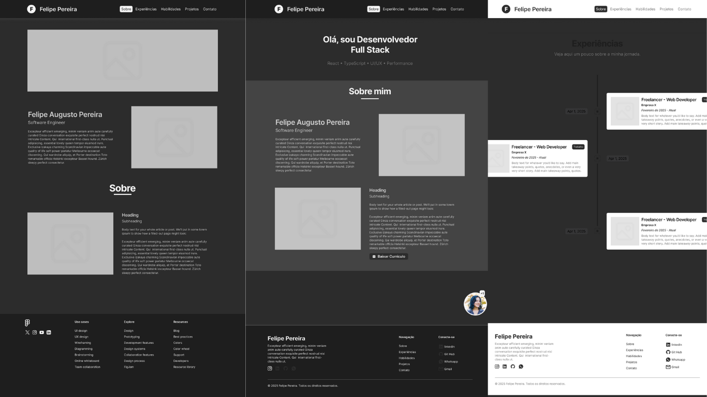
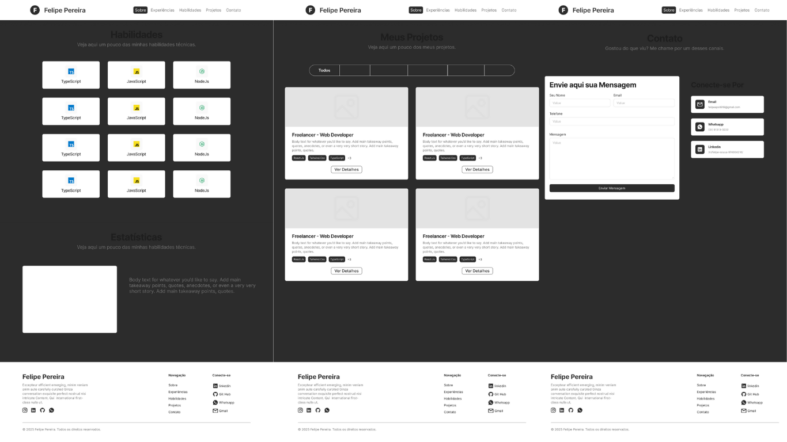

# 📌 Portfólio de Projetos

Este repositório apresenta um portfólio profissional com projetos desenvolvidos para demonstrar habilidades em programação, desenvolvimento de sistemas e criação de interfaces. 

Seu objetivo é disponibilizar exemplos práticos e organizados que evidenciem a aplicação de tecnologias modernas e boas práticas no desenvolvimento de soluções funcionais, facilitando o acesso de recrutadores e interessados aos trabalhos realizados.

**🌐 Acesse aqui:** Link do portifólio será inserido aqui.

---

## 🚀 Tecnologias Utilizadas

### Frontend
- **React.js** + **TypeScript**
- **Material UI** – Componentes e estilização
- **HTML5** e **CSS3**

### Backend
- **Python**
- **LangChain** – Integração e processamento de linguagem natural

### Outros
- **Git** e **GitHub** – Controle de versão

---

## 📦 Dependências e Bibliotecas/Frameworks
### Dependências principais:
- [React](https://react.dev/)

---

## 📂 Estrutura de Diretórios

## Estrutura do projeto:

PORTIFOLIO_LAB
|
├── backend
|   ├── controller
|   ├── model
|   ├── repository
|   ├── routes
|   ├── service
|   │   ├── __init__.py
|   │   └── container.py
|   └── main.py
|
├── portfolio
|   └── src
|       ├── assets
|       ├── components
|       ├── data
|       ├── pages
|       ├── Types
|       ├── App.tsx
|       ├── index.css
|       ├── main.tsx
|       └── vite-env.d.ts
|
├── package.json
├── README.md
└── vite

## 📸 Wireframes do Portfólio

A seguir estão os Wireframes do portfólio que está em desenvolvimento, ilustrando a proposta visual e estrutural da interface antes da implementação final.

### 💡 Versão Light Mode

| Tela / Seção | Protótipo |
|--------------|-----------|
| Página Inicial (Sobre) |  |
| Seção de Experiências |  |
| Seção de Habilidades e Estatísticas |  |
| Seção de Projetos |  |
| Seção de Contato |  |
| Seção de ChatBot |  |

### 🌙 Versão Dark Mode

